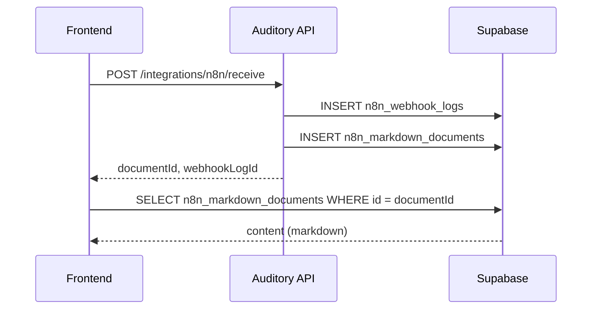

# Esquema de métodos N8N y tablas Supabase

Documentación del modelo de datos, la relación entre cada **método HTTP** de la integración N8N y las **tablas** en Supabase, y la **implementación en el frontend** (Vue, React, etc.).

---

## Tabla de contenidos

1. [Archivo SQL](#archivo-sql)
2. [Diagrama de relaciones](#diagrama-de-relaciones)
3. [Métodos HTTP → Tablas](#métodos-http--tablas)
4. [Tablas Supabase](#tablas-supabase)
5. [Vista y consultas SQL](#vista-y-consultas-sql)
6. [Implementación en el frontend](#implementación-en-el-frontend)
7. [Orden de ejecución en Supabase](#orden-de-ejecución-en-supabase)

---

## Archivo SQL

Ejecuta en el editor SQL de Supabase:

```
supabase/n8n_integration_schema.sql
```

---

## Diagrama de relaciones

```
                    ┌─────────────────────┐
                    │  n8n_webhook_logs   │
                    │  (auditoría HTTP)   │
                    │  request_payload    │
                    └──────────┬──────────┘
                               │
              ┌────────────────┴────────────────┐
              │                                 │
              ▼                                 ▼
   ┌──────────────────────┐        ┌──────────────────────────┐
   │  n8n_text_exchanges  │        │ n8n_markdown_documents   │
   │  POST /send          │        │ POST /receive            │
   │  (texto ↔ N8N)       │        │ POST /markdown/upload    │
   └──────────────────────┘        │  content (markdown)      │
                                   └──────────────────────────┘
```

> Toda la persistencia de markdown es en **Supabase**. La API ya no escribe archivos en `storage/n8n-markdown/`.

---

## Métodos HTTP → Tablas

| Método | Ruta | Dirección | Tabla principal | Tabla de log |
|--------|------|-----------|-----------------|--------------|
| `POST` | `/api/v1/integrations/n8n/send` | `outbound` | `n8n_text_exchanges` | `n8n_webhook_logs` |
| `POST` | `/api/v1/integrations/n8n/send` | `inbound`* | `n8n_markdown_documents` | `n8n_webhook_logs` |
| `POST` | `/api/v1/integrations/n8n/receive` | `inbound` | `n8n_markdown_documents` | `n8n_webhook_logs` |
| `POST` | `/api/v1/integrations/n8n/markdown/upload` | `inbound` | `n8n_markdown_documents` | `n8n_webhook_logs` |

\* Si el body de `/send` incluye `gemini_response`, la API redirige al flujo de recepción (markdown en Supabase).

### Flujo de persistencia (entrante)

Por cada `POST` a `/receive` o `/markdown/upload` (o `/send` con payload Gemini):

1. **`n8n_webhook_logs`** — body completo en `request_payload` + metadatos HTTP.
2. **`n8n_markdown_documents`** — contenido markdown, metadatos Gemini y FK `webhook_log_id`.

La respuesta HTTP devuelve `documentId` y `webhookLogId` para enlazar la UI con Supabase.

---

## Tablas Supabase

### 1. `n8n_webhook_logs`

Registro de **todas** las peticiones a los endpoints N8N.

| Columna | Tipo | Descripción |
|---------|------|-------------|
| `id` | UUID | PK |
| `http_method` | VARCHAR(10) | Siempre `POST` |
| `endpoint` | VARCHAR(50) | `send` \| `receive` \| `markdown/upload` |
| `direction` | VARCHAR(10) | `inbound` \| `outbound` |
| `payload_type` | VARCHAR(20) | `text` \| `gemini` \| `markdown` \| `legacy_text` |
| `status` | VARCHAR(20) | `success` \| `failed` |
| `request_payload` | JSONB | Body recibido (completo, validado) |
| `response_payload` | JSONB | Resumen enviado al cliente |
| `error_message` | TEXT | Mensaje si `status = failed` |
| `duration_ms` | INTEGER | Duración de la operación |
| `created_at` | TIMESTAMPTZ | Fecha de registro |

#### Valores de `payload_type` por endpoint

| Endpoint | Body ejemplo | `payload_type` |
|----------|--------------|----------------|
| `/send` | `{ "text": "..." }` | `text` |
| `/send` | `{ "task", "gemini_response" }` | `gemini` |
| `/receive` | `{ "task", "gemini_response" }` | `gemini` |
| `/receive` | `{ "filename", "content" }` | `markdown` |
| `/receive` | `{ "text": "..." }` | `legacy_text` |
| `/markdown/upload` | `{ "filename", "content" }` | `markdown` |

---

### 2. `n8n_text_exchanges`

Almacena intercambios del endpoint **`POST /send`** (texto saliente hacia N8N).

| Columna | Tipo | Descripción |
|---------|------|-------------|
| `id` | UUID | PK |
| `webhook_log_id` | UUID | FK → `n8n_webhook_logs` |
| `request_text` | TEXT | Texto enviado a N8N |
| `response_text` | TEXT | Texto devuelto por N8N |
| `request_metadata` | JSONB | Metadatos del request |
| `response_metadata` | JSONB | Metadatos de la respuesta |
| `created_at` | TIMESTAMPTZ | |
| `updated_at` | TIMESTAMPTZ | |

#### Request HTTP

```http
POST /api/v1/integrations/n8n/send
Content-Type: application/json

{
  "text": "Analiza este síntoma auditivo",
  "metadata": { "patientId": "uuid", "source": "frontend" }
}
```

#### Registro en tablas

1. Insert en `n8n_webhook_logs`: `endpoint = 'send'`, `direction = 'outbound'`, `payload_type = 'text'`.
2. Insert en `n8n_text_exchanges`: `request_text`, `response_text`, metadatos.

---

### 3. `n8n_markdown_documents`

Almacena documentos Markdown de **`POST /receive`** y **`POST /markdown/upload`**.

| Columna | Tipo | Descripción |
|---------|------|-------------|
| `id` | UUID | PK — usar como `documentId` en el frontend |
| `webhook_log_id` | UUID | FK → `n8n_webhook_logs` |
| `filename` | VARCHAR(255) | Nombre del archivo `.md` |
| `content` | TEXT | Contenido markdown completo |
| `content_length` | INTEGER | Longitud del contenido |
| `storage_path` | TEXT | Reservado; actualmente `null` (sin disco) |
| `source_type` | VARCHAR(20) | `gemini` \| `direct_upload` \| `legacy_text` |
| `task` | TEXT | Descripción de tarea (Gemini) |
| `source_timestamp` | TIMESTAMPTZ | `timestamp` del payload Gemini |
| `gemini_finish_reason` | VARCHAR(50) | ej. `MAX_TOKENS`, `STOP` |
| `gemini_role` | VARCHAR(50) | ej. `model` |
| `gemini_raw_response` | JSONB | Objeto `gemini_response` completo |
| `metadata` | JSONB | Metadatos adicionales |
| `created_at` | TIMESTAMPTZ | |
| `updated_at` | TIMESTAMPTZ | |

#### A) Payload Gemini → `source_type = 'gemini'`

```json
{
  "task": "Documentación para la API RECS",
  "gemini_response": {
    "content": {
      "parts": [{ "text": "# Título\nContenido..." }],
      "role": "model"
    },
    "finishReason": "MAX_TOKENS",
    "index": 0
  },
  "timestamp": "2026-05-18T10:59:06.932-05:00",
  "filename": "opcional.md",
  "metadata": { "author": "n8n-bot" }
}
```

| Campo HTTP | Columna en BD |
|------------|---------------|
| `task` | `task` |
| `gemini_response` | `gemini_raw_response` |
| `gemini_response.finishReason` | `gemini_finish_reason` |
| `gemini_response.content.role` | `gemini_role` |
| `parts[].text` (concatenado) | `content` |
| `timestamp` | `source_timestamp` |
| `metadata` | `metadata` |

#### B) Subida directa → `source_type = 'direct_upload'`

```json
{
  "filename": "guia-implementacion.md",
  "content": "# Guía\n\nContenido...",
  "metadata": { "category": "documentacion" }
}
```

#### C) Texto legacy → `source_type = 'legacy_text'`

```json
{
  "text": "Contenido en texto plano",
  "metadata": {}
}
```

---

## Vista y consultas SQL

### Vista `n8n_integration_summary`

```sql
SELECT * FROM n8n_integration_summary
ORDER BY created_at DESC
LIMIT 20;
```

| Columna | Descripción |
|---------|-------------|
| `log_id` | ID del log |
| `endpoint` | `send` / `receive` / `markdown/upload` |
| `direction` | `inbound` / `outbound` |
| `payload_type` | Tipo de payload |
| `status` | `success` / `failed` |
| `text_exchange_id` | ID si fue intercambio de texto |
| `markdown_document_id` | ID si fue markdown |
| `markdown_filename` | Nombre del archivo |

### Consultas útiles

```sql
-- Últimos documentos markdown
SELECT id, filename, source_type, task, content_length, created_at
FROM n8n_markdown_documents
ORDER BY created_at DESC
LIMIT 10;

-- Intercambios de texto fallidos
SELECT l.*, t.request_text
FROM n8n_webhook_logs l
JOIN n8n_text_exchanges t ON t.webhook_log_id = l.id
WHERE l.status = 'failed' AND l.endpoint = 'send';

-- Documentos generados por Gemini
SELECT id, filename, task, gemini_finish_reason, created_at
FROM n8n_markdown_documents
WHERE source_type = 'gemini';
```

---

## Implementación en el frontend

### Configuración

```env
# .env
VITE_API_BASE_URL=http://localhost:3000
VITE_SUPABASE_URL=https://xxx.supabase.co
VITE_SUPABASE_ANON_KEY=eyJ...
```

| Variable | Uso |
|----------|-----|
| `VITE_API_BASE_URL` | Llamadas `POST` a `/api/v1/integrations/n8n/*` |
| `VITE_SUPABASE_URL` / `VITE_SUPABASE_ANON_KEY` | Listar y leer documentos ya guardados |

> Hoy la API solo expone endpoints **POST** para N8N. Para **listar o mostrar** markdown guardado, consulta Supabase desde el cliente (o añade endpoints `GET` en la API más adelante).

### Headers

| Header | Cuándo |
|--------|--------|
| `Content-Type: application/json` | Siempre en POST con body |
| `X-API-KEY` o `Authorization: Bearer <secret>` | Si el backend tiene `N8N_API_KEY` o `N8N_WEBHOOK_SECRET` |

---

### Cliente HTTP base

```typescript
// src/api/httpClient.ts

const BASE_URL = import.meta.env.VITE_API_BASE_URL ?? 'http://localhost:3000';

export async function apiRequest<T>(
  path: string,
  options: { method?: string; body?: unknown; headers?: Record<string, string> } = {}
): Promise<T> {
  const { method = 'GET', body, headers = {} } = options;

  const response = await fetch(`${BASE_URL}${path}`, {
    method,
    headers: { 'Content-Type': 'application/json', ...headers },
    body: body !== undefined ? JSON.stringify(body) : undefined,
  });

  const data = await response.json().catch(() => ({}));

  if (!response.ok) {
    const message =
      typeof data.error === 'string'
        ? data.error
        : data.error?.message ?? `Error HTTP ${response.status}`;
    throw new Error(message);
  }

  return data as T;
}
```

---

### Tipos TypeScript (alineados con la API)

```typescript
// src/types/n8n.ts

/** Respuesta común al guardar markdown en Supabase */
export interface N8nMarkdownStoredResult {
  filename: string;
  contentLength: number;
  documentId: string;
  webhookLogId: string;
  task?: string;
  timestamp?: string;
  metadata?: Record<string, unknown>;
}

export interface N8nApiSuccess<T> {
  success: true;
  data: T;
}

/** POST /send — texto saliente */
export interface N8nSendTextRequest {
  text: string;
  metadata?: Record<string, unknown>;
}

export interface N8nSendTextResult {
  text: string;
  metadata?: Record<string, unknown>;
  exchangeId: string;
  webhookLogId: string;
}

/** POST /receive — payload Gemini */
export interface N8nGeminiReceiveRequest {
  task: string;
  gemini_response: {
    content: {
      parts: Array<{ text?: string; thoughtSignature?: string }>;
      role?: string;
    };
    finishReason?: string;
    index?: number;
  };
  timestamp?: string;
  filename?: string;
  metadata?: Record<string, unknown>;
}

/** POST /markdown/upload — subida directa */
export interface N8nMarkdownUploadRequest {
  filename: string;
  content: string;
  metadata?: Record<string, unknown>;
}

/** Fila de Supabase para listados en UI */
export interface N8nMarkdownDocumentRow {
  id: string;
  webhook_log_id: string | null;
  filename: string;
  content: string;
  content_length: number;
  source_type: 'gemini' | 'direct_upload' | 'legacy_text';
  task: string | null;
  source_timestamp: string | null;
  gemini_finish_reason: string | null;
  metadata: Record<string, unknown>;
  created_at: string;
}
```

---

### Servicio `n8nApi.ts`

```typescript
// src/api/n8nApi.ts

import { apiRequest } from './httpClient';
import type {
  N8nApiSuccess,
  N8nGeminiReceiveRequest,
  N8nMarkdownStoredResult,
  N8nMarkdownUploadRequest,
  N8nSendTextRequest,
  N8nSendTextResult,
} from '@/types/n8n';

const N8N_BASE = '/api/v1/integrations/n8n';

const n8nHeaders = (): Record<string, string> => {
  const key = import.meta.env.VITE_N8N_API_KEY;
  return key ? { 'X-API-KEY': key } : {};
};

/** Texto saliente → n8n_text_exchanges + n8n_webhook_logs */
export function sendTextToN8n(payload: N8nSendTextRequest) {
  return apiRequest<N8nApiSuccess<N8nSendTextResult>>(`${N8N_BASE}/send`, {
    method: 'POST',
    body: payload,
    headers: n8nHeaders(),
  });
}

/** Gemini / N8N entrante → n8n_markdown_documents + n8n_webhook_logs */
export function receiveMarkdownFromGemini(payload: N8nGeminiReceiveRequest) {
  return apiRequest<N8nApiSuccess<N8nMarkdownStoredResult>>(`${N8N_BASE}/receive`, {
    method: 'POST',
    body: payload,
    headers: n8nHeaders(),
  });
}

/** Subida directa desde el frontend */
export function uploadMarkdown(payload: N8nMarkdownUploadRequest) {
  return apiRequest<N8nApiSuccess<N8nMarkdownStoredResult>>(
    `${N8N_BASE}/markdown/upload`,
    { method: 'POST', body: payload, headers: n8nHeaders() }
  );
}
```

---

### Respuestas HTTP actuales

#### `POST /send` (texto saliente)

```json
{
  "success": true,
  "data": {
    "text": "Respuesta de N8N",
    "metadata": {},
    "exchangeId": "uuid-intercambio",
    "webhookLogId": "uuid-log"
  }
}
```

Guardar en estado local `exchangeId` / `webhookLogId` si necesitas trazabilidad o enlaces a auditoría.

#### `POST /receive` y `POST /markdown/upload` (markdown entrante)

```json
{
  "success": true,
  "data": {
    "filename": "documentacion-api-recs-2026-05-18T10-59-06.md",
    "contentLength": 4521,
    "documentId": "uuid-documento",
    "webhookLogId": "uuid-log",
    "task": "Documentación para la API RECS",
    "timestamp": "2026-05-18T10:59:06.932-05:00",
    "metadata": {
      "finishReason": "MAX_TOKENS",
      "geminiRole": "model"
    }
  }
}
```

> **Importante:** ya no se devuelve `path` ni ruta en disco. Usa `documentId` para cargar el contenido desde Supabase.

También se acepta el envoltorio de n8n con `body`:

```json
{
  "body": {
    "task": "...",
    "gemini_response": { ... }
  }
}
```

---

### Leer documentos desde Supabase (listado / detalle)

```typescript
// src/api/n8nDocumentsApi.ts

import { createClient } from '@supabase/supabase-js';
import type { N8nMarkdownDocumentRow } from '@/types/n8n';

const supabase = createClient(
  import.meta.env.VITE_SUPABASE_URL!,
  import.meta.env.VITE_SUPABASE_ANON_KEY!
);

export async function listMarkdownDocuments(limit = 20) {
  const { data, error } = await supabase
    .from('n8n_markdown_documents')
    .select(
      'id, filename, content_length, source_type, task, created_at, metadata'
    )
    .order('created_at', { ascending: false })
    .limit(limit);

  if (error) throw error;
  return data;
}

export async function getMarkdownDocumentById(id: string) {
  const { data, error } = await supabase
    .from('n8n_markdown_documents')
    .select('*')
    .eq('id', id)
    .single();

  if (error) throw error;
  return data as N8nMarkdownDocumentRow;
}
```

Ejemplo en un componente Vue tras guardar:

```typescript
const { data } = await receiveMarkdownFromGemini(geminiPayload);
const doc = await getMarkdownDocumentById(data.documentId);
// doc.content → renderizar markdown en la UI
```

---

### Flujos recomendados en la UI

| Escenario | Llamada API | Qué mostrar al usuario |
|-----------|-------------|------------------------|
| Usuario envía texto a N8N | `sendTextToN8n({ text, metadata })` | `data.text` (respuesta) |
| Llega respuesta Gemini al cliente | `receiveMarkdownFromGemini(payload)` | Confirmación + `data.filename`; opcional enlace con `documentId` |
| Usuario sube `.md` desde formulario | `uploadMarkdown({ filename, content, metadata })` | Mismo formato que Gemini |
| Historial de documentos | `listMarkdownDocuments()` (Supabase) | Tabla: filename, task, fecha, `source_type` |
| Ver documento guardado | `getMarkdownDocumentById(documentId)` | Renderizar `content` (markdown) |



---

### Ejemplo composable Vue 3

```typescript
// src/composables/useN8nMarkdown.ts

import { ref } from 'vue';
import { receiveMarkdownFromGemini, uploadMarkdown } from '@/api/n8nApi';
import { getMarkdownDocumentById, listMarkdownDocuments } from '@/api/n8nDocumentsApi';

export function useN8nMarkdown() {
  const loading = ref(false);
  const error = ref<string | null>(null);
  const documents = ref<Awaited<ReturnType<typeof listMarkdownDocuments>>>([]);

  async function saveFromGemini(payload: Parameters<typeof receiveMarkdownFromGemini>[0]) {
    loading.value = true;
    error.value = null;
    try {
      const { data } = await receiveMarkdownFromGemini(payload);
      return await getMarkdownDocumentById(data.documentId);
    } catch (e) {
      error.value = (e as Error).message;
      throw e;
    } finally {
      loading.value = false;
    }
  }

  async function saveDirect(payload: Parameters<typeof uploadMarkdown>[0]) {
    loading.value = true;
    error.value = null;
    try {
      const { data } = await uploadMarkdown(payload);
      return await getMarkdownDocumentById(data.documentId);
    } catch (e) {
      error.value = (e as Error).message;
      throw e;
    } finally {
      loading.value = false;
    }
  }

  async function refreshList() {
    documents.value = await listMarkdownDocuments();
  }

  return { loading, error, documents, saveFromGemini, saveDirect, refreshList };
}
```

---

### Errores HTTP

| Código | Causa | Acción en frontend |
|--------|-------|-------------------|
| `400` | Validación Zod (campos vacíos, formato Gemini) | Mostrar `error` o `details` del body |
| `401` | Webhook sin credencial | Enviar `X-API-KEY` si está configurado |
| `503` | `N8N_WEBHOOK_URL` no configurada en `/send` saliente | Avisar que N8N no está disponible |
| `500` | Fallo Supabase / servidor | Mensaje genérico; el log puede quedar en `n8n_webhook_logs` con `status = failed` |

---

### Checklist frontend (N8N + Supabase)

- [ ] `VITE_API_BASE_URL` configurada
- [ ] `VITE_SUPABASE_URL` y `VITE_SUPABASE_ANON_KEY` configuradas
- [ ] SQL `supabase/n8n_integration_schema.sql` ejecutado en Supabase
- [ ] Módulo `n8nApi.ts` con `sendTextToN8n`, `receiveMarkdownFromGemini`, `uploadMarkdown`
- [ ] Módulo `n8nDocumentsApi.ts` para listar/leer por `documentId`
- [ ] Tipos en `src/types/n8n.ts` (sin campo `path` en respuestas)
- [ ] UI usa `documentId` / `webhookLogId`, no rutas de disco
- [ ] (Opcional) `VITE_N8N_API_KEY` si el backend exige autenticación en webhooks

---

## Orden de ejecución en Supabase

1. Ejecuta `supabase/n8n_integration_schema.sql` (o migración `003_n8n_integration_tables.sql`).
2. Verifica en **Table Editor**: `n8n_webhook_logs`, `n8n_text_exchanges`, `n8n_markdown_documents`.
3. Configura RLS/policies según tu entorno (desarrollo: políticas permisivas incluidas en el SQL).
4. Prueba desde el frontend un `POST /receive` y comprueba filas nuevas en ambas tablas.

---

*Ver también: `docs/frontend-integracion-n8n-calendario.md` (calendario, tareas programadas y sección N8N ampliada).*
